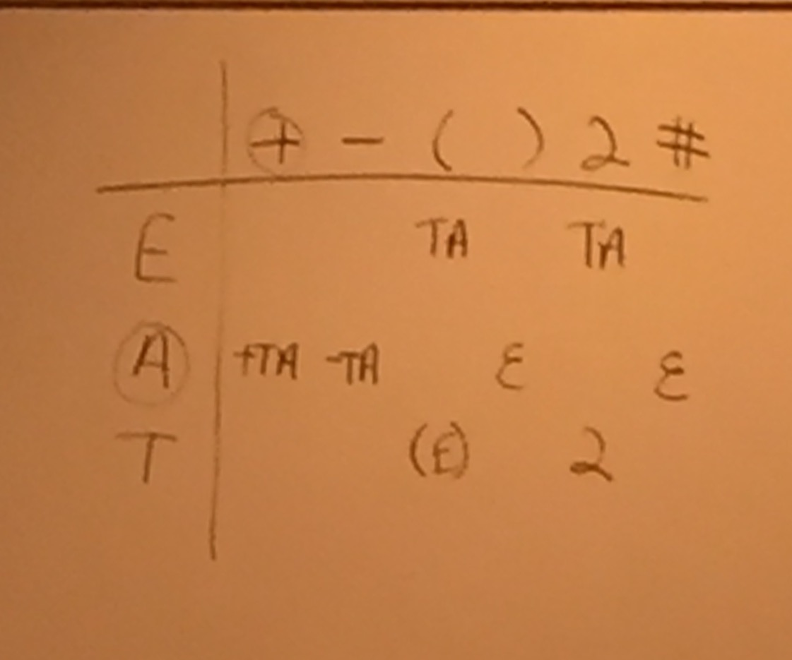

# Class 3 - June 25
#### Topics
* Ambiguous Grammars
* Table Driven Parsing

# Ambiguous Grammars
A grammar is ambiguous if you can draw 2 _different_ parse trees that produce _exactly the same result_.

```
E -> E + E
E -> E - E
E -> E * E
E -> E / E
E -> ( E )
E -> 0 | 1 | 2 | 3 | 4 | 5 | 6 | 7 | 8 | 9
```

For `2*3+6`, you can produce: 
```
         E                       E
       / | \                   / | \
      E  +  E                 E  *  E
    / | \   |        &        |   / | \        
    E * E   6                 2   E + E
    |   |                         |   |
    2   3                         3   6
```

Which is **BAD!** You can actually produce results that have the incorrect precedence.

To prevent some ambiguity, you could rewrite the grammar as follows:
```
E -> E + E
E -> E - E
E -> T
T -> T * T
T -> T / T
T -> F
F -> (E)
F -> 0 | 1 | 2 | 3 | 4 | 5 | 6 | 7 | 8 | 9
```

The "levels" of E, T, and F help give precedence to the grammar.

With this grammar, we HAVE to do it in the right order. The plus has to happen first, and then the `*` happens further down.

```
            E
          / | \
         E  +  E
         |     |
         T     T
       /|\     |
      T * T    F
      |   |    |
      F   F    6
      |   |
      2   3
```

**But the grammar is still ambiguous with `+` and `-`**. So....

```
E -> E + T                                  
E -> E - T                             
E -> T                                 
T -> T * F                             
T -> T / F                             
T -> F                                        
F -> ( E )                                  
F -> 0 | 1 | 2 | 3 | 4 | 5 | 6 | 7 | 8 | 9  
```


### Class Example

The following grammar for boolean expressions is ambiguous. Rewrite the grammar so that it is unambiguous. Use the following rules for precedence and associativity:
* Order of precedence is 'not' (highest), 'and' (middle), 'or' (lowest)
* The binary operators 'and' and 'or' associate left-to-right.
* The unary operator 'not' associates right-to-left.

```
B -> B and B           |        B -> B or C
B -> B or B            |        B -> C
B -> not B             |        C -> C and D
B -> ( B )             |        C -> D
B -> true | false      |        D -> not D
                       |        D -> E
                       |        E -> ( B )
                       |        E -> true | false
```


# Parse Tables

Using:
```
E -> T A
A -> + T A | - T A | epsilon
T -> ( E ) | 2
```

Parse `2+2`

**Stack-based parser**
```
STACK       INPUT       OUTPUT
E#          2+2#
TA#         2+2#
2A#         2+2#
A#          +2#         2
+TA#        +2#         2
TA#         2#          2 +
2A#         2#          2 +
A#          #           2 + 2
EPSILON#    #           2 + 2
#           #           2 + 2   VALID SYNTAX
```


#### Class Example
```
S -> if E then S
S -> E = E
E -> number | ident
```

Parse `if x then y = 2`

```
STACK           INPUT               OUTPUT
S#              if x then y = 2#
if E then S#    if x then y = 2#     
E then S#       x then y = 2#       if
ident then S#   x then y = 2#       if
then S#         then y = 2#         if ident
S#              y = 2#              if ident then
E = E#          y = 2#              if ident then
ident = E#      y = 2#              if ident then
= E#            = 2#                if ident then ident
E#              2#                  if ident then ident =
number#         2#                  if ident then ident =
#               #                   if ident then ident = number
                                    VALID SYNTAX
```


### A Parse Table

