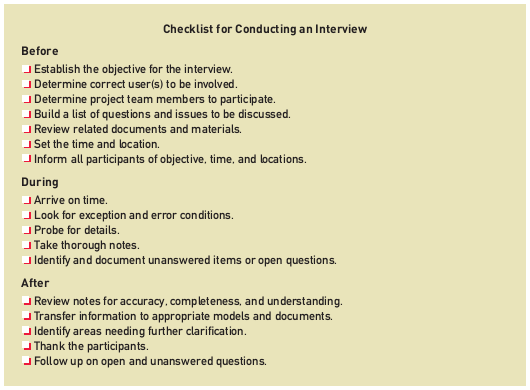

# Chapter 2

### Systems Analysis Activites

* Gather Detailed information
    - Interviews, questionnaires, documents, observing business processes, research vendors, comments and suggestions
* Define requirements
    - Modeling functional requirements and non-functional requirements
* Prioritize Requirements
    - Essential or important vs. nice to have
* Develop User-Interface Dialogs
* Evaluate Requirements with Users

### What are Requirements

**System Requirements** are all the activities a new system must perform or support and the constrains a new system must meet.
* **Functional Requirements** - the activities a system _must_ perform
* **Non-functional Requirements** - usability, reliability, performance, security

**FURPS** describes systems requirements. It stands for **F**unctionality, **U**sability, **R**eliability, **P**erformance, **S**ecurity. **FURPS+** includes design constraints, implementation, interface, physical, support. 

### Models

* Textual models - reports, memos, narratives, lists
* Graphical models - easier to show and understand complex relationships; screen designs report layout design
* Mathematical models - formulas that describe technical aspects of a system.

### Stakeholders

Stakeholders are all the people who have an interest in the successful implementation of the system.

* **Internal** stakeholders are those who interact with the system or have a significant interest in its operation or success
* **External** stakeholders are those outside the organization's control and influence. 
* **Operational** stakeholders are those who regularly interact with a system in their jobs or lives. Bookkeepers, factor workers, etc.
* **Executive** stakeholders are those who do not interact with the system but use information produced by it or have significant financial interest in its success.

### Information-Gathering Techniques
* Interviewing users and other stakeholders
    - Very time consuming, but great information
* Distributing and collecting questionnaires
    - Easy, but information isn't always great
* Reviewing inputs, outputs, and documentation
* Observing and documenting business procedures
    - Again, very time consuming
* Researching vendor solutions
* Collecting active user comments and suggestions

##### Interviewing Users
* Prepare detailed questions
* Meet with individuals or groups
* Obtain and discuss answers
* Document answers

##### Themes for information gathering

| Theme | Questions to Users |
| --- | --- |
| What are the business operations and processes? | What do you do? |
| How should those operations be performed? | How do you do it? What steps do you follow? How could they be done differently? |
| What information is needed to perform those operations | What information do you use? What inputs do you use? What outputs do you produce? |

