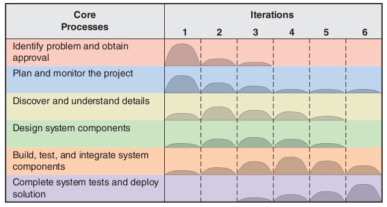

# Class 2 - September 8

### Topics
* Chapter 1

### Overview
* **Computer Application (app)** - a computer software program that executes on a computing device to carry out a specific set of functions.
    - Modest scope
* **Information Systems** - a set of interrelated components that collects, processes, stores, and provides as output the information needed to complete business tasks.
    - Broader in scope than "app"
    - Includes database and related manual proccesses
* **Systems Analysis** - those activites that enable a person to understand and specify what an information system should accomplish
* **System development lifecycle (SDLC)** - the entire process consisting of all activities required to build, launch, and maintain an information system.
    - Identify the problem and obtain approval
    - Plan and monitor the project
    - Discover and understand the details of the problem
    - Design the system
    - Build, test, and integrate
    - Complete tests and deploy the solution

### Iterative and Agile SDLC

**Gratitude Moment**
I am grateful for opportunites I have had to gain technical skills and work on projects in the past.

6 processes of the SDLC:
1. Identify the problem or need and obtain approval to proceed.
2. Plan and monitor the project
3. Discover and understand the details of the problem
    * Also goes by the name of _systems analysis_
4. Design the system 
5. Build, test, and integrate the system
6. Complete testing and deploy the solution

**Technology Architecture** - the set of computing hardware, network hardware and topology, and system software employed by an organization.
**Application architecture** - describes how software resources are organized and constructed to implement an organization's information systems.

Substeps of _Systems Analysis_
* Gather detailed information
* Define requirements
* Prioritize Requirements
* Develop User-Interface Dialogs
* Evaluate Requirements with Users

**System Requirements** - all the activities a new systems must perform or support and the contraints that the new system must meet.
**Functional Requirements** - the activities that the system must perform.
**Nonfunctional Requirements** - characteristics of a system other than those activities it must perform or support.

**FURPS** - Functionality, Usability, Reliability, performance, security
* Functionality - the activities that the system must perform.
* Usability - operational characteristics related to users, such as the user interface, related work procedures, online hel, and documentation.
* Reliability - the dependability of a system - how often a system has service outages or incorrect processing and how it recovers from those problems
* Performance - operational characteristics related to measures of workload (throughput, response time)
* Security - how access to the application will be controlled and  how data will be protected in transmission

**FURPS+** - FURPS with a few more constraints
* Design - restrictions to which the hardware and software must adhere (uses Android, no more than 10MB system memory, etc.)
* Implementation - constrains such as required programming languages, documentation method, lebel of detail, etc.
* Interface - interactions among systems. XML? Generate Twitter messages?
* Physical - Size, weight, power consumption, etc.
* Supportability - how it is install,ed configured, monitored, etc.

**Model** - a representation of some aspect of the system being built
* Textual models - memos, reports, narratives, lists. 
* Graphical models - easier to show and understand complex relationships; screen designs, report layout design
* Mathematical models - formulas that describe technical aspects of a system.

**Examples of analysis and design models**: Event list, use case diagram, use case description, location diagram, class diagram, sequence diagram, communication diagram, state machine

# Stakeholders
Stakeholders are all the people who have an interest in the successful implementation of the system.
* Internal stakeholders are those who interact with the system or have a significant interest in its operation or success
* External stakeholders are those outside the organization's control and influence. 
* Operational stakeholders are those who regularly interact with a system in their jobs or lives. Bookkeepers, factor workers, etc.
* Executive stakeholders are those who do not interact with the system but use information produced by it or have significant financial interest in its success.

# Information-Gathering Techniques
* Interviewing users and other stakeholders
* Distributing and collecting questionnaires
* Reviewing inputs, outputs, and documentation
* Observing and documenting business procedures
* Researching vendor solutions
* Collecting active user comments and suggestions

